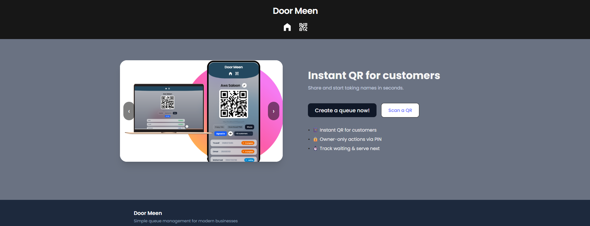
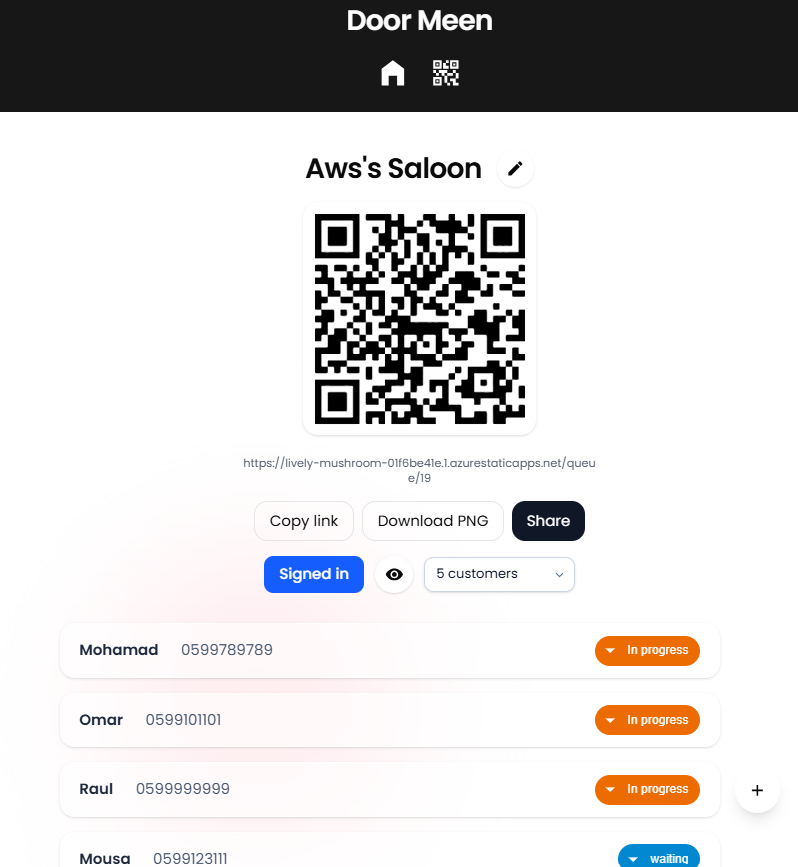

# DoorMeen - Digital Queue Management System


A modern, full-stack digital queue management system that enables businesses to manage customer queues efficiently with QR codes, real-time updates, and secure owner controls.

## 🚀 Live Demo

**Live Application:** [https://lively-mushroom-01f6be41e.1.azurestaticapps.net/](https://lively-mushroom-01f6be41e.1.azurestaticapps.net/)

## 📸 Screenshots

### Home Page


### Owner Dashboard


## 🏗️ Architecture & Tech Stack

### Frontend (React + TypeScript)
- **Framework:** React 19.1.1 with TypeScript
- **Build Tool:** Vite 7.1.6
- **Routing:** React Router DOM 7.9.1
- **Styling:** Tailwind CSS 4.1.13 + Framer Motion 12.23.19
- **UI Components:** Material-UI 7.3.2 + Custom Components
- **State Management:** React Hooks + Context
- **QR Code:** React QR Code 2.0.18 + QR Scanner
- **Notifications:** Sonner 2.0.7
- **Testing:** Vitest 3.2.4 + Testing Library
- **Validation:** Zod 4.1.11

### Backend (.NET 8 Web API)
- **Framework:** ASP.NET Core 8.0
- **Database:** PostgreSQL with Entity Framework Core 9.0.9
- **Authentication:** JWT Bearer Tokens
- **Security:** BCrypt.Net-Next 4.0.3 for password hashing
- **Architecture:** Clean Architecture with Service Layer Pattern
- **Testing:** xUnit with Integration Tests
- **Authorization:** Custom Policy-based Authorization

### DevOps & Deployment
- **Frontend:** Azure Static Web Apps
- **Backend:** Azure App Service
- **Database:** Azure PostgreSQL
- **CI/CD:** GitHub Actions (implied)

## 🔄 Application Flow

### 1. Queue Creation Flow
```
Owner → Creates Queue → Sets Name & PIN → Receives QR Code → Shares QR Code
```

### 2. Customer Join Flow
```
Customer → Scans QR Code → Enters Name & Phone → Joins Queue → Receives Position
```

### 3. Queue Management Flow
```
Owner → Logs in with PIN → Views Customer List → Manages Queue → Serves Customers
```

## 🎯 Key Features

### For Queue Owners
- **Secure Authentication:** PIN-based login system
- **Real-time Queue Management:** View all customers in queue
- **Customer Actions:** Serve next, skip, or remove customers
- **Queue Settings:** Set maximum customers and queue name
- **QR Code Generation:** Instant QR codes for customer scanning

### For Customers
- **Easy Joining:** Scan QR code and enter details
- **Position Tracking:** See current position in queue
- **Privacy Protection:** Phone numbers are hashed for privacy
- **Cancel Option:** Cancel registration with unique token
- **Real-time Updates:** Live position updates

### System Features
- **Responsive Design:** Works on desktop and mobile
- **Real-time Updates:** Live queue status updates
- **Security:** JWT authentication, password hashing, input validation
- **Error Handling:** Comprehensive error handling and user feedback
- **Testing:** Unit and integration tests with high coverage

## 🏛️ Code Quality & Architecture

### Frontend Architecture
- **Component-based:** Modular React components with clear separation of concerns
- **Custom Hooks:** Reusable logic extraction (`useOwnerSession`, `useOwnerGuard`)
- **Type Safety:** Full TypeScript implementation with strict typing
- **Error Boundaries:** Graceful error handling and user feedback
- **Performance:** Optimized with React.memo, useMemo, and useCallback
- **Accessibility:** ARIA labels and keyboard navigation support

### Backend Architecture
- **Clean Architecture:** Separation of concerns with Application, Infrastructure, and API layers
- **Service Layer Pattern:** Business logic abstraction with direct DbContext access
- **Dependency Injection:** IoC container for loose coupling
- **Custom Authorization:** Policy-based authorization handlers
- **Exception Handling:** Global exception handling with proper HTTP status codes
- **Data Validation:** Input validation with Data Annotations and custom validators

### Testing Strategy
- **Unit Tests:** Comprehensive unit test coverage for business logic
- **Integration Tests:** API endpoint testing with test database
- **Mock Services:** MSW (Mock Service Worker) for frontend testing
- **Test Utilities:** Reusable test data and helper functions

## 🔧 Development Setup

### Prerequisites
- Node.js 18+ and npm
- .NET 8 SDK
- PostgreSQL database

### Frontend Setup
```bash
cd apps/web
npm install
npm run dev
```

### Backend Setup
```bash
cd apps/api/Api
dotnet restore
dotnet ef database update
dotnet run
```

### Environment Variables
Create `.env` files with:
- `VITE_API_BASE_URL` - Backend API URL
- Database connection strings
- JWT configuration

## 🧪 Testing

### Frontend Tests
```bash
cd apps/web
npm run test:unit        # Unit tests
npm run test:unit:cov    # Coverage report
npm run test:ui          # Test UI
```

### Backend Tests
```bash
cd apps/api/Api.Tests
dotnet test
```

## 📁 Project Structure

```
DoorMeen/
├── apps/
│   ├── api/                 # Backend API
│   │   ├── Api/            # Main API project
│   │   │   ├── controllers/ # API controllers
│   │   │   ├── models/     # Data models
│   │   │   ├── Application/ # Business logic
│   │   │   ├── Infrastructuer/ # Data access
│   │   │   └── security/   # Security utilities
│   │   └── Api.Tests/      # Integration tests
│   └── web/                # Frontend React app
│       ├── src/
│       │   ├── components/ # Reusable components
│       │   ├── pages/      # Page components
│       │   ├── features/   # Feature modules
│       │   ├── hooks/      # Custom hooks
│       │   └── test/       # Test files
│       └── public/         # Static assets
└── screenshots/            # Application screenshots
```

## 🔐 Security Features

- **JWT Authentication:** Secure token-based authentication
- **Password Hashing:** BCrypt for secure password storage
- **Input Validation:** Server-side validation for all inputs
- **CORS Configuration:** Proper cross-origin resource sharing
- **Authorization Policies:** Role-based access control
- **SQL Injection Prevention:** Entity Framework parameterized queries

## 🚀 Deployment

The application is deployed on Azure:
- **Frontend:** Azure Static Web Apps
- **Backend:** Azure App Service
- **Database:** Azure PostgreSQL

## 🤝 Contributing

1. Fork the repository
2. Create a feature branch
3. Make your changes
4. Add tests for new functionality
5. Submit a pull request


## 🎉 Acknowledgments

- Built with modern web technologies
- Follows industry best practices
- Comprehensive testing coverage
- Clean, maintainable codebase
- Responsive and accessible design

---

**DoorMeen** - Making queue management simple, secure, and efficient! 🚪✨
